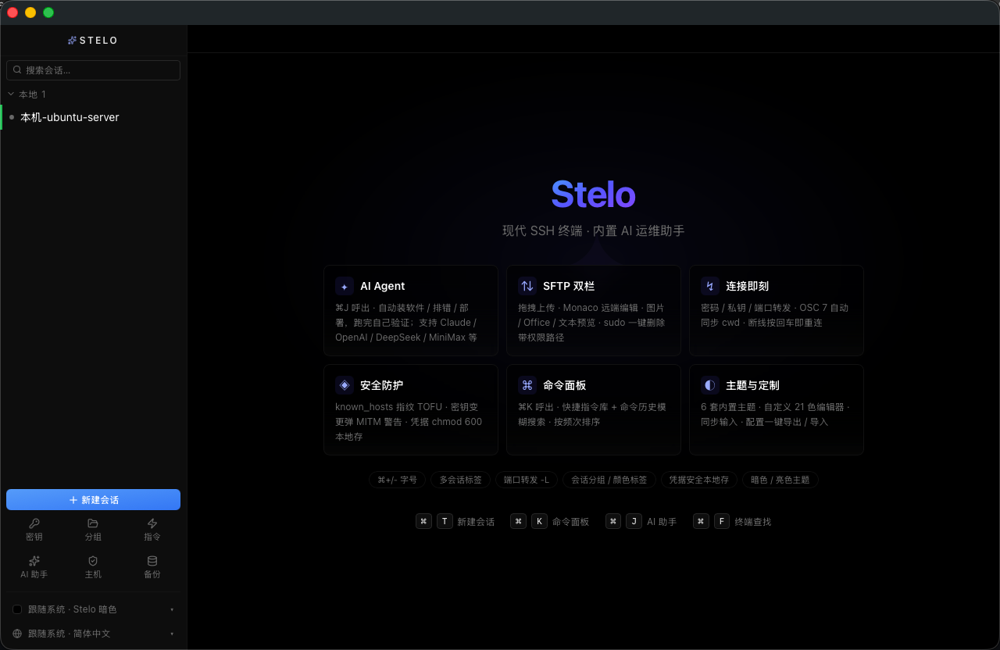
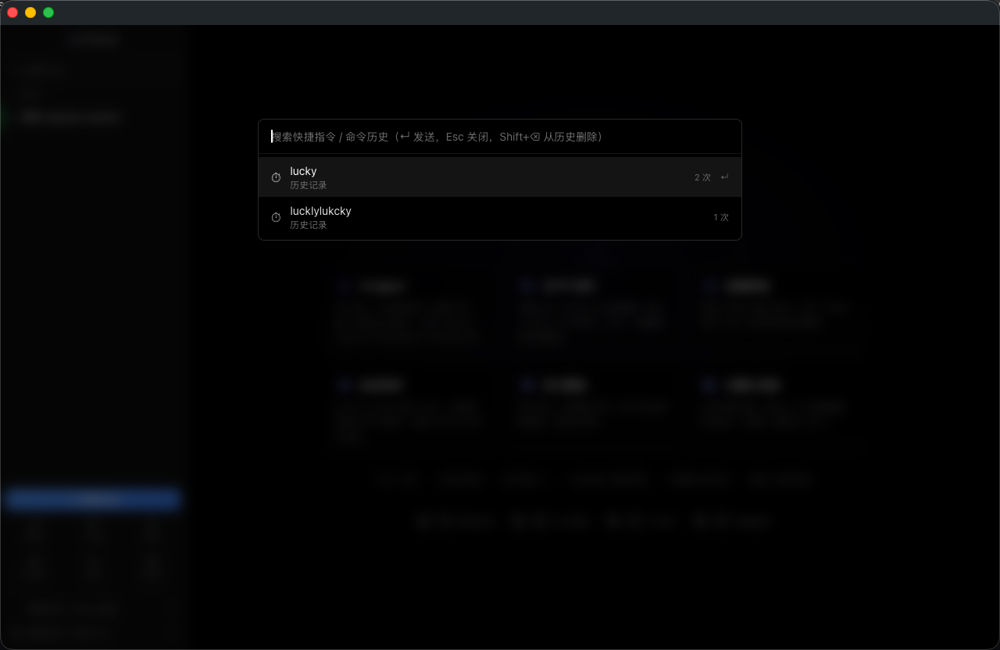

<div align="center">

# Stelo

**A modern SSH terminal with a built-in AI ops agent**
**现代 SSH 终端 · 内置 AI 运维助手**

[](./LICENSE)
[](https://tauri.app)
[](#-download--安装)
[](https://github.com/luckylee6666/stelo/actions/workflows/release.yml)

[English](#english) · [中文](#中文)

</div>

> Stelo is a cross-platform SSH client that aims to be approachable for beginners — same lane as
> Termius / Tabby / XShell — with one big differentiator: a built-in **AI Agent** (Claude / OpenAI /
> DeepSeek / MiniMax / …) that can install software, troubleshoot, deploy apps, and verify its own work.
>
> The name comes from Esperanto: *Stelo* = star — "connecting the servers across the galaxy".

---

## 📸 Screenshots / 截图

| Welcome screen / 欢迎页 | Command palette (`⌘K`) / 命令面板 |
|---|---|
|  |  |

> More shots coming — a connected terminal, the AI Agent drawer (`⌘J`) mid-task, and the SFTP panel + Monaco editor. See [`docs/screenshots/`](./docs/screenshots) for the shot list.

---

## English

### ✨ Features

#### 🤖 AI Agent — the core differentiator
- `⌘J` opens a bottom drawer that never covers the terminal.
- Native **`tool_use` protocol** + streaming replies — no more brittle regex code-block extraction.
- Providers: Claude / OpenAI / DeepSeek / Kimi / Qwen / Ollama / **MiniMax Token Plan** (Anthropic-compatible).
- **Attachments**: 📎 pick a local file / 📁 recurse a whole directory and SFTP it to `/tmp/`; the AI can `cat` / `bash` it directly.
- **Interactive-prompt detection**: when it sees `[sudo] password for ...`, `[y/N]`, an SSH passphrase, etc., it surfaces a prominent hint asking *you* to type into the terminal — the AI stops blindly sending commands.
- **Retry & switch provider**: on a 529 overload it shows "Retry / Switch to <provider>" buttons.
- **Agent history isolation**: rich `tool_use` content blocks are stored per-turn, so they aren't flattened/polluted into the AI repeating itself.

#### 🔐 SSH
- Password / private key (ED25519 / RSA / ECDSA) + a standalone key store (reuse one key across sessions).
- **known_hosts TOFU fingerprinting**: recorded on first connect; a changed fingerprint later raises a red MITM warning.
- Port forwarding (local `-L`) — configure rules in the session editor, started automatically on connect.
- Press Enter to auto-reconnect after a drop (using saved credentials).
- OSC 7 keeps the remote `cwd` in sync.

#### 📁 SFTP dual-pane
- A docked file panel on the right; drag-and-drop upload.
- Double-click a remote file to edit it in **Monaco**, `⌘S` to write back.
- Preview images / Office (`.docx` / `.xlsx`) / text.
- Make directory / rename / delete (with confirmation).
- On **Permission denied**, a sudo-password dialog pops up for a one-click `sudo -S` delete; the password is cached in memory for 15 minutes only, never on disk.

#### 🎨 Themes & customization
- 8 built-in themes: **Stelo Light / Stelo Dark** (brand pure-white / pure-black), Neutral, Dracula, Solarized Dark·Light, Tokyo Night, Gruvbox Dark.
- Follows the system light/dark setting automatically.
- Custom theme editor (21 colors).
- 6 font-size steps — `⌘+` / `⌘-` / `⌘0` to reset.

#### 🌐 Internationalization
- Chinese / English UI.
- Follows the system language automatically.
- Adding a new language is just one dictionary file.

#### 🛠 Workflow
- Multi-session tabs (`⌘T` new / `⌘W` close).
- Session groups + color labels.
- Snippet library + fuzzy command-history search (`⌘K` command palette, ranked by frequency).
- Broadcast input to multiple sessions 📡.
- Terminal find (`⌘F`, case-sensitive / whole-word).
- Live CPU / MEM / LOAD / NET in the status bar.
- One-click export / import of all config as JSON (move machines or share with a friend).
- Pasting >3 lines pops a confirm to prevent accidental paste.

#### 🛡 Security (commercial-grade)
The lifeblood of an SSH tool — see [SECURITY.md](./SECURITY.md).

- **Credentials encrypted at rest with AES-256-GCM**; the key is derived with **Argon2id** (machine-derived IKM ‖ persisted random `master_salt`) — copying the file to another machine is undecryptable.
- **Private keys / passwords zeroized in memory**: wrapped in `Zeroizing<String>`, the heap buffer is overwritten on drop.
- **Mandatory host-key fingerprint confirmation on first connect** — replaces silent TOFU, blocks MITM.
- **Private-key file permission check** — same as OpenSSH, `~/.ssh/id_rsa` must be `0600`.
- **Tauri Isolation Pattern** — every IPC call goes through a sandboxed iframe that whitelists command names.
- **Strict CSP** — `connect-src` only allows IPC + localhost; all external network goes through the Tauri proxy.
- **Auto-redaction of command history / AI prompts** — many rule classes (passwords, tokens, API keys, JWTs, AWS keys); strict mode blanks the whole segment.
- **Local audit log** — `audit.log` (`chmod 600`, 10 MB rolling) records sensitive operations; `credential_load` is rate-limited to 6×/60s/account.
- All data files are `chmod 600`; it deliberately does **not** use the macOS Keychain (avoids repeated authorization prompts under a dev signature).

### 🧱 Tech stack

| Layer | Choice |
|---|---|
| Desktop framework | Tauri 2.x (Rust backend + WebView frontend, ~10 MB dmg) |
| Frontend | React 19 + TypeScript + Vite |
| UI | Tailwind v4 + Zustand + Lucide Icons |
| Terminal | xterm.js + addon-webgl / fit / search / unicode11 / web-links |
| SSH / SFTP | russh 0.51 + russh-sftp 2 |
| AI | tauri-plugin-http (bypasses WebView CORS) + Anthropic/OpenAI SSE streaming |
| File editing | Monaco (remote) + SheetJS + mammoth (Office preview) |

### 📦 Download / 安装

Grab a build from the [**Releases**](https://github.com/luckylee6666/stelo/releases) page:

| Platform | Asset |
|---|---|
| macOS (Apple Silicon, arm64) | `Stelo_x.y.z_aarch64.dmg` |
| Windows x64 | `Stelo_x.y.z_x64-setup.exe` |
| Windows arm64 | `Stelo_x.y.z_arm64-setup.exe` |

> **Not code-signed yet** (Apple Developer is $99/yr, Windows EV cert is also paid — not purchased yet).
> - macOS: first launch needs **right-click → Open** to get past Gatekeeper.
> - Windows: SmartScreen may warn — click **More info → Run anyway**.

Linux builds aren't produced by CI yet (Tauri supports it; mostly a testing question). Build from source below.

### 🚀 Build from source

```bash
pnpm install
pnpm tauri dev          # dev mode — HMR + Rust auto-rebuild
pnpm tauri build        # release build (dmg / msi / nsis for the current OS)

pnpm tsc --noEmit       # frontend type-check
pnpm vitest run         # frontend unit tests (59)
cd src-tauri && cargo test --lib                # Rust unit tests (67)
cd src-tauri && cargo test --lib -- --ignored   # smoke tests (need a real test server)
```

Toolchain: Rust 1.94+ · Node 22+ · pnpm 10+.

### 🏗 Releasing (CI)

Pushing a `v*` tag triggers [`.github/workflows/release.yml`](./.github/workflows/release.yml), which builds **macOS arm64**, **Windows x64** and **Windows arm64** in parallel and uploads them to a **draft GitHub Release**. Review the draft, then publish it.

```bash
# bump the version in package.json, src-tauri/tauri.conf.json, src-tauri/Cargo.toml first
git tag v0.1.0
git push origin v0.1.0
```

### 🗺 Roadmap

Done (v0.1.x): ✅ SSH + SFTP + AI Agent + themes + i18n + known_hosts + config export/import + macOS & Windows CI builds.

Next candidates:

- [ ] **Code signing + notarization** (drop the first-launch Gatekeeper / SmartScreen warnings)
- [ ] **Auto-update** (Tauri updater)
- [ ] **Linux CI builds** (`.AppImage` / `.deb`)
- [ ] **Remote `-R` / dynamic `-D` SOCKS5 forwarding**
- [ ] **Local shell (portable-pty)** — open a terminal without SSH
- [ ] **Zmodem (`rz` / `sz`)**
- [ ] **Pane splitting (horizontal / vertical) + tmux-style layouts**
- [ ] **Session recording / replay / export to GIF·MP4**
- [ ] **SFTP path bookmarks** (`/opt`, `/var/log`, … one-click jump)
- [ ] **Tab drag-to-reorder**

### 🤝 Contributing

Issues and PRs welcome. Before opening a PR:

1. `pnpm tsc --noEmit && pnpm vitest run` and `cd src-tauri && cargo test --lib` should pass.
2. For Rust changes, run `cargo fmt` and `cargo clippy`.
3. Anything touching credentials, IPC, CSP or the audit log: please describe the threat model in the PR — see [SECURITY.md](./SECURITY.md).

To report a security vulnerability, please **don't** open a public issue — see [SECURITY.md](./SECURITY.md).

### 📝 License

[MIT](./LICENSE) © 2026 Stelo Authors.

---

## 中文

> 名字来源：世界语 "Stelo" = 星，寓意"连接星河间的服务器"。Stelo 是一款以"小白也能上手"为目标的跨平台 SSH 客户端，和 Termius / Tabby / XShell 同赛道，差异化在**内置 Claude / OpenAI / DeepSeek / MiniMax 等多家 AI 的 Agent 模式**——能自动装软件、排查故障、部署应用，跑完还会自己验证。

### ✨ 核心功能

#### 🤖 AI Agent（核心差异点）
- `⌘J` 呼出底部抽屉，不挡终端
- 原生 **tool_use 协议** + 流式回复，告别正则提代码块的不稳定
- 支持 Claude / OpenAI / DeepSeek / Kimi / 通义 / Ollama / **MiniMax Token Plan**（Anthropic 兼容）
- **附件上传**：📎 选本地文件 / 📁 整棵目录递归 SFTP 上传到 /tmp/，AI 直接 cat / bash
- **交互提示识别**：检测到 `[sudo] password for ...` / `[y/N]` / SSH passphrase 等，弹醒目提示让用户去终端输入，AI 不再瞎发命令
- **失败重试 + 换 Provider**：529 过载时弹"重试 / 切到 XXX Provider"按钮
- **Agent 历史隔离**：tool_use 富内容块跨轮独立保存，不会被扁平化污染造成 AI 复读

#### 🔐 SSH
- 密码 / 私钥（ED25519 / RSA / ECDSA）+ 独立密钥库（多会话复用一把 key）
- **known_hosts 指纹 TOFU**：首次自动记录，后续指纹变化弹红色 MITM 警告
- 端口转发（本地 -L），编辑会话里配规则，连接时自动启动
- 断线后按回车自动重连（用保存的凭据）
- OSC 7 自动同步远端 cwd

#### 📁 SFTP 双栏
- 右侧常驻文件面板，拖拽上传
- 远端文件双击用 **Monaco** 直接编辑，⌘S 回写
- 图片 / Office（.docx / .xlsx）/ 文本预览
- 新建目录 / 重命名 / 删除（带二次确认）
- **Permission denied 时弹 sudo 密码对话框**，一键 `sudo -S` 删除；密码仅内存缓存 15 分钟，不落盘

#### 🎨 主题与定制
- 8 套内置：**Stelo Light / Stelo Dark**（品牌纯白 / 纯黑）、Neutral / Dracula / Solarized Dark·Light / Tokyo Night / Gruvbox Dark
- 跟随系统深浅色自动切换
- 自定义主题（21 色编辑器）
- 6 级字号 ⌘+/- / ⌘0 重置

#### 🌐 国际化
- 中 / 英双语界面
- 跟随系统语言自动切换
- 扩展新语言只需加一份字典文件

#### 🛠 工作流
- 多会话标签（⌘T 新建 / ⌘W 关闭）
- 会话分组 + 颜色标签
- 快捷指令库 + 命令历史模糊搜索（`⌘K` 命令面板，按频次排序）
- 多会话同步输入 📡
- 终端查找（`⌘F`，区分大小写 / 全词匹配）
- StatusBar 实时 CPU / MEM / LOAD / NET 展示
- 配置一键导出 / 导入 JSON（换机器或分享给朋友）
- 粘贴 >3 行弹 confirm 防误粘

#### 🛡 安全（商用级）
SSH 工具的命脉。详见 [SECURITY.md](./SECURITY.md)。

- **凭据 AES-256-GCM 加密落盘**，密钥经 **Argon2id** 派生（机器派生 IKM ‖ 持久化随机 master_salt），跨机器拷贝不可解
- **私钥 / 密码 内存清零**：`Zeroizing<String>` 包裹，drop 时自动覆写堆缓冲区
- **首次连接强制确认 host key 指纹**：替代静默 TOFU，防中间人
- **私钥文件权限校验**：与 OpenSSH 一致，`~/.ssh/id_rsa` 必须 `0600`
- **Tauri Isolation Pattern**：所有 IPC 经 sandbox iframe 命令名白名单校验
- **严格 CSP**：`connect-src` 只允许 IPC + localhost；外部网络全部经 Tauri 代理
- **命令历史 / AI prompt 自动脱敏**：密码 / token / API key / JWT / AWS key 多类规则；AI 严格模式整段屏蔽
- **本地审计日志**：`audit.log`（`chmod 600`，10MB 滚动）记录敏感操作；`credential_load` 速率限制 6 次/60秒/account
- 所有数据文件 `chmod 600`，不走 macOS Keychain（避免 dev 签名反复弹授权）

### 🧱 技术栈

| 层 | 选型 |
|---|---|
| 桌面框架 | Tauri 2.x（Rust 后端 + WebView 前端，dmg ~10MB）|
| 前端 | React 19 + TypeScript + Vite |
| UI | Tailwind v4 + Zustand + Lucide Icons |
| 终端 | xterm.js + addon-webgl / fit / search / unicode11 / web-links |
| SSH / SFTP | russh 0.51 + russh-sftp 2 |
| AI | tauri-plugin-http（绕 WebView CORS）+ Anthropic/OpenAI SSE 流式 |
| 文件编辑 | Monaco（远端）+ SheetJS + mammoth（Office 预览）|

### 📦 安装

去 [**Releases**](https://github.com/luckylee6666/stelo/releases) 页下载对应平台的包：

| 平台 | 文件 |
|---|---|
| macOS（Apple Silicon / arm64） | `Stelo_x.y.z_aarch64.dmg` |
| Windows x64 | `Stelo_x.y.z_x64-setup.exe` |
| Windows arm64 | `Stelo_x.y.z_arm64-setup.exe` |

> **暂未代码签名**（Apple Developer $99/年、Windows EV 证书也要钱，都还没买）。
> - macOS：首次打开需 **右键 → 打开** 绕 Gatekeeper。
> - Windows：SmartScreen 可能拦截 —— 点 **更多信息 → 仍要运行**。
>
> Linux 包暂时没接 CI（Tauri 本身支持，主要是测试问题），需要的话按下面从源码构建。

### 🚀 从源码构建

```bash
pnpm install
pnpm tauri dev          # 开发模式，HMR + Rust 自动重编
pnpm tauri build        # release 构建（按当前系统出 dmg / msi / nsis）

pnpm tsc --noEmit       # 前端类型检查
pnpm vitest run         # 前端单测（59）
cd src-tauri && cargo test --lib                # Rust 单测（67）
cd src-tauri && cargo test --lib -- --ignored   # smoke tests（需真实测试服务器）
```

工具链：Rust 1.94+ · Node 22+ · pnpm 10+。

### 🏗 发版（CI）

推一个 `v*` tag 会触发 [`.github/workflows/release.yml`](./.github/workflows/release.yml)，并行构建 **macOS arm64**、**Windows x64**、**Windows arm64** 三份产物，上传到一个 **GitHub Release 草稿**。检查草稿没问题后手动发布。

```bash
# 先把版本号在 package.json、src-tauri/tauri.conf.json、src-tauri/Cargo.toml 里改一致
git tag v0.1.0
git push origin v0.1.0
```

### 🗺 Roadmap

已完成（v0.1.x）：✅ SSH + SFTP + AI Agent + 主题 + i18n + known_hosts + 配置导出入 + macOS & Windows CI 打包

下一轮候选：

- [ ] **代码签名 + Notarization**（去掉首次打开 Gatekeeper / SmartScreen 警告）
- [ ] **自动更新**（Tauri updater）
- [ ] **Linux CI 打包**（`.AppImage` / `.deb`）
- [ ] **远程 -R / 动态 -D SOCKS5 转发**
- [ ] **本地 shell（portable-pty）** —— 不用 SSH 也能开终端
- [ ] **Zmodem（rz / sz）**
- [ ] **面板分割（水平 / 垂直）+ tmux 风格布局**
- [ ] **会话录制回放 / 导出 GIF / MP4**
- [ ] **SFTP 路径书签**（/opt / /var/log 等一键跳）
- [ ] **Tab 拖拽重排**

### 🤝 参与贡献

欢迎 Issue / PR。开 PR 前请确认：

1. `pnpm tsc --noEmit && pnpm vitest run` 和 `cd src-tauri && cargo test --lib` 通过；
2. Rust 改动跑 `cargo fmt` 和 `cargo clippy`；
3. 涉及凭据 / IPC / CSP / 审计日志的改动，请在 PR 里说明威胁模型 —— 参考 [SECURITY.md](./SECURITY.md)。

报告安全漏洞**请勿**开公开 Issue —— 见 [SECURITY.md](./SECURITY.md)。

### 📝 License

[MIT](./LICENSE) © 2026 Stelo Authors。

---

<div align="center">

Made with ☕ and ✦ 紫色星辰，2026.

</div>
